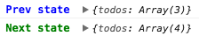

# Easy-state
Simple state manipulation without any frameworks.
<br><br>
[](https://travis-ci.org/oyvindhermansen/easy-state) [](https://codecov.io/gh/oyvindhermansen/easy-state)

## Getting started
First things first; import the module:
```js
import createStateTree from 'easy-state';
```
To get you started, initialize a state tree with the function `createStateTree`.
```js
const store = createStateTree({
  counter: 1,
});
```
To retrieve the current state at any point in time, use `getState`:
```js
store.getState();
```
To alter any state from your state tree, use `setState`:
```js
store.setState({
  counter: 2
});
```
Keep your UI in sync with your state by using `subscribe`:
```js
store.subscribe((prevState, nextState) => {
  DOMElement.innerHTML = nextState.counter;
});
```

## Counter-example:
```js
const store = createStateTree({ counter: 0 });

const initEventListeners = () => {
  myIncrementButton.addEventListener('click', handleIncrement);
  myDecrementButton.addEventListener('click', handleDecrement);
};

const handleIncrement = () => {
  const counter = store.getState().counter;
  store.setState({ counter: counter + 1 });
}

const handleDecrement = () => {
  const counter = store.getState().counter;
  store.setState({ counter: counter - 1 });
}

const renderCounter = (counter) => {
  myDOMCounterElement.innerHTML = counter;
}

initEventListeners();
renderCounter(store.getState().counter);

store.subscribe((prevState, nextState) => {
  renderCounter(nextState.counter);
});
```

> For larger applications you can divide your stores into
> smaller pieces, to get more control over certain parts.

## Logger
EasyState also provides a logger to make the developer experience better.
It takes the advantage of the subscribe method provided from `createStateTree` to log `prev` and `next` state to the console on every state change.



> NB: You should remove the logger before shipping to production.

Here's how to use it:
```js
import createStateTree, { logger } from 'easy-state';

const store = createStateTree({ counter: 1 });

/**
* Pass the store to the logger
**/
logger(store)
```

### Developing easy-state

Install
```sh
$ git clone https://github.com/oyvindhermansen/easy-state.git
$ cd easy-state
$ yarn install
```

Run the demo whitch is powered by webpack and webpack dev-server.
The dev-server listens for changes in both `demo/` and `src/`, so you can write module implementation and testing it in the browser at the same time.
```sh
$ yarn dev
```

Unit testing
```sh
$ yarn test
$ yarn test:watch
```

Test coverage
```sh
$ yarn coverage
```

Prettier
```sh
# Targets src, demo and __tests__ folders.
$ yarn prettier
```

Build for production
```sh
$ yarn build
```


### Motivation
I've often come across projects that needed to use plain jquery or vanilla JavaScript instead of any frameworks e.g React or VueJS, and there is one thing I've missed: Possibilty to have application state in sync with my UI without any hassle.

### Inspiration
The library is inspired by both React and Redux. It's sort of a Redux-lib, without the reducers, action-creators and dispatching actions, but instead changing state with setState()-method like they do in React.
